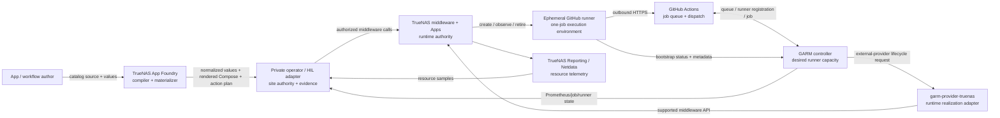
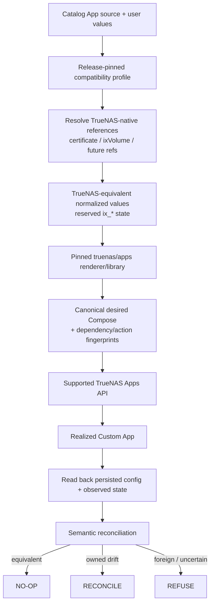
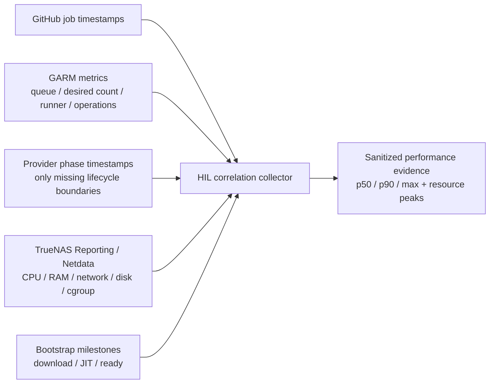

# System Responsibility Model

This document is the canonical human-readable responsibility and boundary model for the Foundry/GARM/TrueNAS runner system. The machine-readable companion is `docs/system-responsibility-model.json`.

The design principle is **one authority per concern**. Components may observe another component's state, but should not silently become a second authority for that state.

## System context



## Authority map

| Concern | Authority | Responsible executor | Important boundary |
| --- | --- | --- | --- |
| Catalog source and application intent | App/workflow author | author + Foundry validation | Runtime must not infer lost author intent from containers alone. |
| TrueNAS-version compatibility | Foundry compatibility profile | Foundry gates/tests | Fail closed when pinned middleware/apps contracts drift. |
| Catalog normalization/materialization | Foundry | Foundry materializer | Reproduce supported catalog semantics; do not patch deployed middleware. |
| Site secrets and explicit host mutation authorization | Private operator/HIL layer | local operator tooling | Public Foundry never owns site credentials or private keys. |
| TrueNAS host/App lifecycle | TrueNAS middleware | TrueNAS supported API | Provider/Foundry do not drive Docker/containerd internals directly. |
| Desired GitHub runner capacity | GARM | GARM scale-set/pool logic | Provider does not schedule or maintain an independent capacity policy. |
| TrueNAS runner realization | GARM request is authoritative; provider is adapter | `garm-provider-truenas` | Provider accepts only qualified execution profiles and verifies ownership. |
| GitHub job scheduling/dispatch | GitHub Actions | GitHub | GARM/provider do not proxy workflow execution traffic. |
| Job execution | ephemeral runner | GitHub runner process | One job per environment; environment is disposable. |
| CPU/RAM/network/disk measurement | TrueNAS Reporting/Netdata | TrueNAS reporting collectors | Do not add a duplicate resource sampler while supported telemetry exists. |
| Runner/job/control-plane state | GARM | GARM metrics/state | Reuse GARM Prometheus/job/runner metrics. |
| Cross-layer performance correlation | HIL/evidence layer | read-only collector | Add timestamps/correlation only where existing systems do not expose the phase boundary. |
| Destructive retirement decision | GARM requests retirement; provider proves safety | provider + TrueNAS API | Foreign, active, or unknown state is never treated as permission to delete. |
| Qualification claims | HIL/evidence process | operator + tests | Source inspection/public CI cannot claim live TrueNAS/GitHub behavior. |

## RACI

`A` = accountable/authoritative for the concern, `R` = performs the work, `C` = consulted/input, `I` = informed/observed.

| Activity | Author | Foundry | Operator/HIL | TrueNAS | GARM | Provider | Runner | GitHub |
| --- | --- | --- | --- | --- | --- | --- | --- | --- |
| Define catalog App intent | A/R | C | I | I | I | I | I | I |
| Normalize/render catalog source | C | A/R | I | C | I | I | I | I |
| Resolve native objects (certs/volumes/etc.) | I | A | R | R | I | I | I | I |
| Authorize site mutation | I | I | A/R | I | I | I | I | I |
| Realize long-lived controller App | I | C | R | A/R | I | I | I | I |
| Decide desired runner count | I | I | I | I | A/R | C | I | C |
| Translate runner request to TrueNAS workload | I | I | I | C | A | R | I | I |
| Enforce host resource limits | I | I | I | A/R | C | C | I | I |
| Register/bootstrap ephemeral runner | I | I | I | C | A | C | R | C |
| Dispatch workflow job | I | I | I | I | C | I | C | A/R |
| Execute workflow job | I | I | I | C | I | I | R | A |
| Measure host/container resources | I | I | C | A/R | I | I | I | I |
| Measure job/runner orchestration state | I | I | C | I | A/R | C | I | C |
| Correlate lifecycle performance | I | I | A/R | C | C | C | C | C |
| Retire runner workload | I | I | I | R | A | R | I | I |
| Prove qualification / publish sanitized evidence | I | C | A/R | C | C | C | C | C |

RACI does not override security gates. For example, GARM may be accountable for desired retirement, but the provider still refuses deletion when ownership or inactive state cannot be proven.

## Catalog materialization boundary



Foundry is responsible for compilation/materialization semantics. TrueNAS remains authoritative for native lifecycle objects (certificate storage/ACME, datasets, Apps, runtime state). A Foundry-managed Custom App is not misrepresented as a native catalog App; the objective is supported-API **realization equivalence**, with explicit lifecycle shims where the Custom App API loses catalog metadata.

## GARM runner lifecycle boundary

```mermaid
sequenceDiagram
  participant GH as GitHub Actions
  participant G as GARM
  participant P as garm-provider-truenas
  participant T as TrueNAS middleware
  participant R as Ephemeral runner App

  GH->>G: desired runner capacity / queued job
  G->>P: CreateInstance + JIT bootstrap contract
  P->>P: validate qualified profile + ownership identity
  P->>T: app.create(custom_app=true)
  T-->>P: App state / provider ID
  P-->>G: instance state
  T->>R: start fixed runner container
  R->>G: bootstrap status + fetch JIT metadata
  R->>GH: register/connect outbound HTTPS
  R-->>G: idle/ready + agent ID
  GH->>R: dispatch one workflow job
  R->>R: execute job
  R-->>GH: job completion
  R->>R: exit + erase JIT credential files
  G->>P: Get/List then DeleteInstance
  P->>T: verify owned + inactive; app.delete
  T-->>P: absent
  P-->>G: retired
```

The external provider is a **runtime-realization adapter**, not a scheduler and not the job execution environment. It executes as a short-lived child of GARM and talks to TrueNAS using supported middleware APIs. The ephemeral runner talks directly to GitHub.

## Performance/telemetry responsibility

Do not create a second monitoring stack for the MVP.



For Stage 5, the correlation model should derive at least:

- GARM request -> provider/TrueNAS create latency;
- TrueNAS create -> runner bootstrap start;
- runner download/checksum time;
- JIT credential/bootstrap time;
- total request -> idle/ready cold-start latency;
- GitHub queue -> job-start latency;
- job duration;
- runner retirement latency;
- mean/peak CPU and memory plus available network/block-I/O/cgroup signals.

The collector should first enumerate the release-specific TrueNAS `reporting.netdata_graphs` surface and reuse supported `reporting.netdata_graph` data. If a measurement already exists there or in GARM metrics, Foundry/HIL should consume it rather than recreate it.

## Component hard boundaries

### Foundry

Owns source validation, compatibility profiles, deterministic normalization/materialization, render equivalence tests, dependency fingerprints, and safe desired-state planning. It does **not** own runner scheduling, TrueNAS runtime internals, GitHub job dispatch, or site credentials.

### Private operator / HIL layer

Owns site-specific resolution, explicit mutation authorization, secret-local adapters, read-only discovery, HIL orchestration, correlation, redaction, and evidence publication. It does **not** redesign components during qualification or silently relax gates.

### TrueNAS middleware / Apps

Owns the host's native objects, runtime realization, resource enforcement, lifecycle state, supported reporting data, and API semantics. Other components use supported APIs rather than bypassing middleware.

### GARM

Owns GitHub entity credentials, pools/scale sets, desired runner capacity, JIT metadata/callback contract, runner state, and orchestration metrics. It does not create TrueNAS workloads directly; it delegates provider lifecycle operations.

### garm-provider-truenas

Owns validation/lowering of an approved GARM runner request into the qualified TrueNAS runtime profile, ownership labels, TrueNAS API operations, state translation, fail-closed reconciliation, and safe retirement. It does not independently schedule runners, execute Actions jobs, manage ACME, or own general Foundry materialization.

### Ephemeral runner

Owns bootstrap of its one-job environment, retrieval/use of JIT credentials, direct outbound connection to GitHub, workflow execution, status callbacks, and local credential cleanup. It receives no Docker socket, host path, or persistent work tree in the current Apps profile.

### GitHub Actions

Owns the workflow/job queue and dispatch to a registered runner. GitHub does not need inbound connectivity to TrueNAS/GARM for the intended Scale Set design; runners and GARM establish outbound HTTPS connections.

## Agent decision rules

An automation or agent operating on this system should use these rules:

1. Identify the concern and its authority before changing anything.
2. Prefer observation from the authoritative component over inferred duplicate state.
3. Use supported APIs; do not bypass TrueNAS middleware or GitHub/GARM contracts.
4. Unknown compatibility/runtime states fail closed.
5. Read-only discovery does not imply mutation authorization.
6. Site secrets remain local/private and are never emitted as evidence.
7. A GARM request is not permission to delete unless provider ownership + safe runtime state are proven.
8. Add telemetry only when an existing authoritative telemetry source lacks the required phase boundary.
9. Runtime read-back verifies desired state; it does not replace authoritative source intent.
10. Qualification claims require evidence from the layer being claimed.
